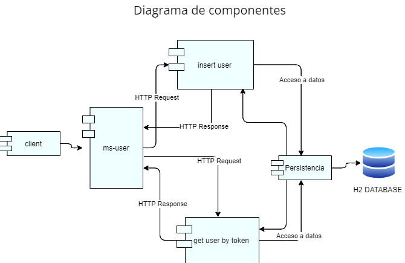
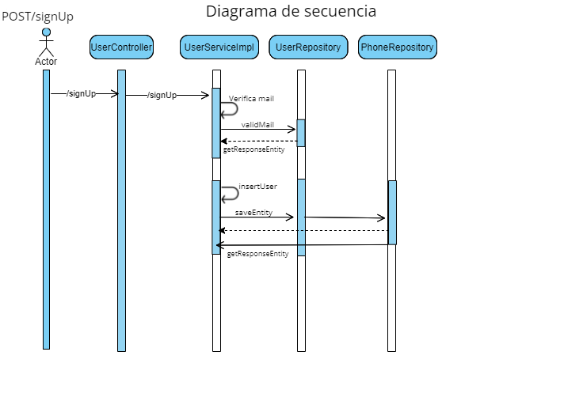
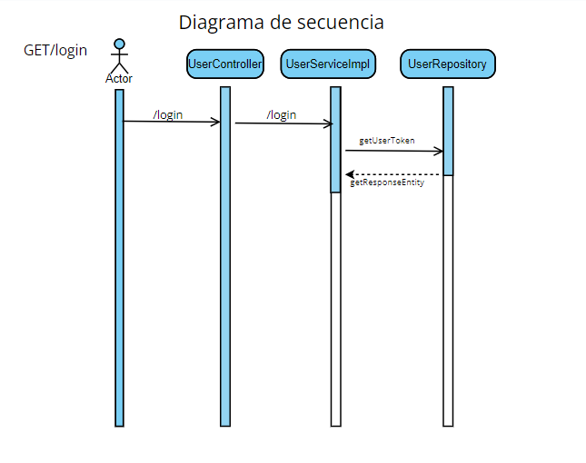

# PRUEBA TÉCNICA API MS-USER
Este microservicio inserta y consulta usuarios en una base de datos H2: 

# Diagrama de componente


# Diagrama de Secuencia endpoint insertar y consultar usuario






# Configuración Local Requerida

* java 8
* gradle
* SpringBoot

# Como levantar el proyecto ms-user

* Si es para Windows ejecutar el siguiente comando:
  Cabe señalar que el comando se debe ejecutar en la carpeta raiz donde se encuentra el proyecto ms-user
  ```
    gradlew bootRun
  ```
* Si es alguna distribución de MAC o Linux ejecutar el comando:
  Cabe señalar que el comando se debe ejecutar en la carpeta raiz donde se encuentra el proyecto ms-user 
```
    ./gradlew bootRun
  ```


# Uso:
En caso de querer revisar la base de datos se debe ir a la url http://localhost:8080/h2/ 

# Prueba de desarrollo Globallogic

Desarrollar un microservicio, cuyo proyecto debe ser SpringBoot / Gradle, para la creación y consulta
de usuarios.

Para ello debe contener un archivo README el cual contenga las instrucciones de construcción,
ejecución del proyecto. Así como también deberá entregar un diagrama de componentes y un
diagrama de secuencia del proyecto cumpliendo estándares UML.
El proyecto debe estar publicado en un repositorio público (github, gitlab o bitbucket) con el código fuente
y una carpeta donde se encuentren los diagramas solicitados.

* Requisitos:

Uso exclusivo de Java 8. (Debe usar más de dos características propias de la versión).
Pruebas unitarias: mínimo requerido, funcionalidades del Service (Deseable: Spock Framework).
Todos los endpoints deben aceptar y retornar solamente JSON inclusive al para los mensajes de error, y
debe retornar el código HTTP que corresponda, considere que debe manejar las excepciones.
Considere los puntos anteriores cómo mínimo, ya que sin éstos el ejercicio no será evaluado.

* /sign-up: endpoint de creación de un usuario, cuyo contrato de entrada debe ser el siguiente:
    

    {
  
        "name": String,
        "email": String,
        "password": String,
        "phones":
                [
                    {
                        "number": long,
                        "citycode": int,
                        "contrycode": String
                    }
                ]
    }

Donde el correo debe seguir una expresión regular para validar que formato sea el
correcto. (aaaaaaa@undominio.algo), si no cumple enviar mensaje de error.

* La clave debe seguir una expresión regular para validar que formato sea el correcto.
Debe tener solo una Mayúscula y solamente dos números (no necesariamente
consecutivos), en combinación de letras minúsculas, largo máximo de 12 y mínimo 8.
"a2asfGfdfdf4", si no cumple enviar mensaje de error.

* El nombre y los teléfonos son campos opcionales.

* En caso de éxito, retornar el usuario y los siguientes campos:
    * id: id del usuario (puede ser lo que se genera por el banco de datos, pero sería
    más deseable un UUID)
    * created: fecha de creación del usuario
    * lastLogin: del último ingreso
    * token: token de acceso de la API (debe utilizar JWT)
    * isActive: Indica si el usuario sigue habilitado dentro del sistema.
  
* El usuario debe ser persistido en una BD utilizando spring data (deseable H2). En caso
de la contraseña, sería ideal que pudiese ser encriptada.

* Si el usuario ya existe, debe enviar mensaje de error indicando que ya existe.

En caso de error de un endpoint debe retornar:


    {
    
    "error": [
                {
                    "timestamp": Timestamp,
                    "codigo": int,
                    "detail": String
                }
            ]
    }

* Deseable:
  
* /login: endpoint el cual será para consultar el usuario, para ello debe utilizar el token generado
en el endpoint anterior para realizar la consulta y así retornar toda la información del usuario
persistido, considere que el token debe cambiar al ejecutar por lo que se actualizará el token.

* El contrato de salida debe ser:


        {
            "id": "e5c6cf84-8860-4c00-91cd-22d3be28904e",
            "created": "Nov 16, 2021 12:51:43 PM",
            "lastLogin": "Nov 16, 2021 12:51:43 PM",
            "token": "eyJhbGciOiJIUzI1NiJ9.eyJzdWIiOiJqdWxpb0B0ZXN0...",
            "isActive": true,
            "name": "Julio Gonzalez",
            "email": "julio@testssw.cl",
            "password": "a2asfGfdfdf4",
            "phones": [
                        {
                            "number": 87650009,
                            "citycode": 7,
                            "contrycode": "25"
                        }
                      ]
        }